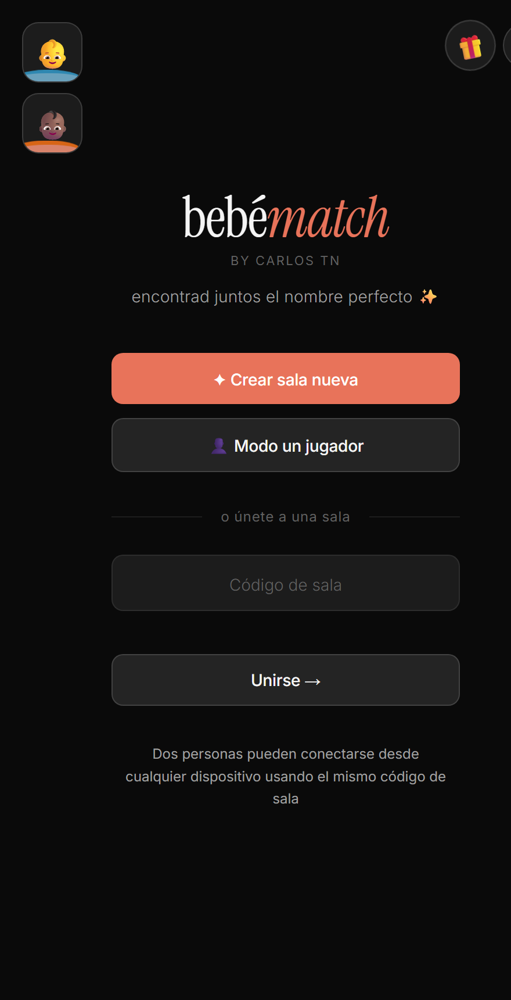

# 10 · Especificación de UI (requisitos a mantener)

> Lista viva de decisiones de interfaz y experiencia que **queremos conservar** al migrar
> la web (`index.html`) a la app nativa. Se va alimentando conforme revisamos la app actual.

---

## 1. Tipografía

Se mantiene la tipografía actual de la web. Son **dos familias de Google Fonts**:

| Rol | Familia | Uso |
|-----|---------|-----|
| **Display / serif** | **Instrument Serif** (a menudo en *itálica*) | Logo `bebématch`, nombres de las cartas, pantalla de match, código de sala, títulos serif |
| **Texto / UI (sans)** | **Inter** (pesos 300, 400, 500, 600) | Cuerpo, botones, inputs, etiquetas, chips, textos secundarios |

**Import (Google Fonts) tal como está hoy en la web:**

```html
<link href="https://fonts.googleapis.com/css2?family=Inter:wght@300;400;500;600&family=Instrument+Serif:ital@0;1&display=swap" rel="stylesheet">
```

```css
/* Texto / UI */
body { font-family: 'Inter', sans-serif; }

/* Display / serif (logo, nombres, match, código de sala…) */
.logo, .card-name, .match-name, .room-code, .title-serif {
  font-family: 'Instrument Serif', serif;
}
```

> En la app nativa (Expo) estas dos fuentes se cargan como assets locales
> (`Inter`, `Instrument Serif`) en lugar de por CDN — ver [03 · Arquitectura objetivo](./03-arquitectura-objetivo.md).

---

## 2. "Únete a una sala" — código directo (sin paso intermedio)

El bloque de unirse a una sala debe funcionar **igual que en el `index.html` actual**:

- El **campo de "Código de sala" está visible directamente** en la pantalla de inicio.
- El usuario **escribe el código ahí mismo** y pulsa **"Unirse →"**.
- **No** debe haber un botón previo tipo "Entrar en sala" que abra otra pantalla o un
  paso extra antes de poder introducir el código.

Es decir: un solo paso — ver el campo, escribir el código, unirse.

---

## 3. Layout de inicio a conservar

Se mantiene el **layout de la pantalla de inicio** tal como está hoy:



Elementos (de arriba a abajo):

- Logo **bebématch** (serif) + tagline *"BY CARLOS TN"* y *"encontrad juntos el nombre perfecto ✨"*.
- Botón primario **✦ Crear sala nueva** (salmón).
- Botón secundario **👤 Modo un jugador**.
- Separador **"o únete a una sala"**.
- Campo **Código de sala** (directo) + botón **Unirse →** (ver punto 2).
- Nota inferior: *"Dos personas pueden conectarse desde cualquier dispositivo usando el mismo código de sala"*.

> **Omitido a propósito:** los minijuegos / easter egg no forman parte de este layout a
> conservar (su futuro se decide aparte — ver [ADR-004](./05-decisiones.md)).
