# Flujo · Modo en pareja (de principio a fin)

> Documenta, pantalla por pantalla, el **flujo completo del modo en pareja**: desde el inicio
> (crear / unirse a una sala) hasta el resumen y el afinado de nombres.
> Se describe el comportamiento para **los dos roles**:
> - 🟠 **Host** — la persona que crea la sala.
> - 🟣 **Guest** — la persona que se une con el código.
>
> Capturas en `../assets/flujos/flujo-en-pareja/`. Reconstruido desde `index.html` (v20.1).

---

## Índice de pantallas del flujo

1. [Home (inicio)](#pantalla-1--home) — común a ambos
2. [Sala de espera (código + QR)](#pantalla-2--sala-de-espera-host) — 🟠 host
3. [Cómo se une el guest](#cómo-se-une-el-guest) — 🟣 guest
4. [Esperando filtros](#pantalla-3--esperando-filtros-guest) — 🟣 guest
5. [Setup — elegir filtros](#pantalla-4--setup-elegir-filtros-host) — 🟠 host
6. [Swipe — baraja de nombres](#pantalla-5--swipe-baraja-de-nombres-común) — común (sincronizado)
7. [Votar una carta (like / no / saltar)](#votar-una-carta-comportamiento-del-swipe)
8. [Match](#pantalla-6--match) — común
9. [Modo RUSH](#modo-rush-variante-del-swipe)
10. [Matches / lista de "me gusta"](#pantalla-7--matches--lista-de-me-gusta)
11. [Fin de la baraja · Espera de resumen](#pantalla-8--fin-de-la-baraja--espera-de-resumen)
12. [Resumen final](#pantalla-9--resumen-final)
13. [Modo Afinar](#modo-afinar-refinar-los-matches)
14. [Comportamientos transversales](#comportamientos-transversales) — salir, reanudar, presencia, persistencia

### Resumen del flujo hasta ahora

```
🟠 HOST                              🟣 GUEST
Home                                 Home
  │ pulsa "Crear sala nueva"           │ escribe código  ó  escanea QR (?join=CODE)
  ▼                                     ▼
Sala de espera (código + QR) ◄────────┤ "Unirse →" / auto-join
  │  (el guest entra en la sala)        │
  ▼                                     ▼
Setup — elige filtros                Esperando filtros ("Estate al loro 👀")
  (solo el host elige)                 (espera a que el host confirme)
```

---

## Pantalla 1 · Home

**ID:** `screen-home` · **Rol:** común (host y guest parten de aquí)

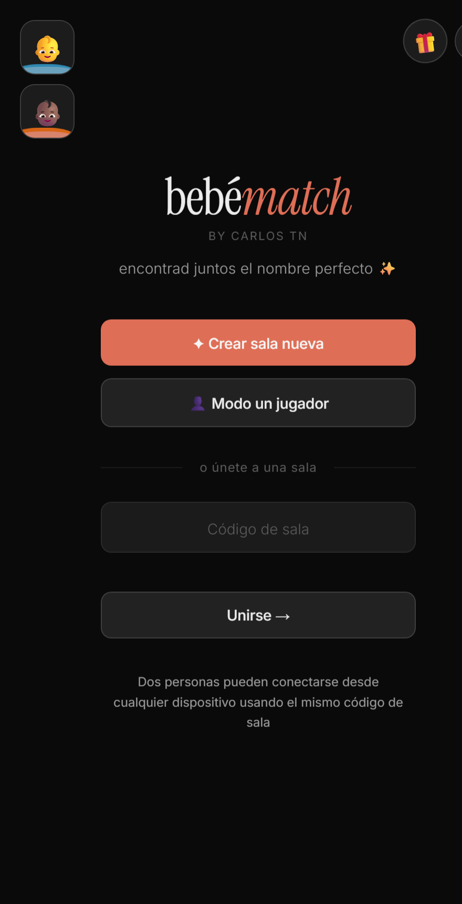

### Qué se ve

De arriba a abajo:

- **Logo** `bebématch` (serif) + byline *"by Carlos Tn"*.
- **Tagline:** *"encontrad juntos el nombre perfecto ✨"*.
- **Botón primario (salmón):** `✦ Crear sala nueva`.
- **Botón secundario:** `👤 Modo un jugador`.
- **Separador:** *"o únete a una sala"*.
- **Campo de código** `Código de sala` (input directo, ver [10 · Especificación UI](../10-especificacion-ui.md)).
- **Botón:** `Unirse →`.
- **Nota:** *"Dos personas pueden conectarse desde cualquier dispositivo usando el mismo código de sala"*.
- **Esquina superior derecha:** botón de tema 🌙 y botón "nombre del día" 🎁.

### Comportamiento por control

| Control | Acción | Resultado |
|---------|--------|-----------|
| `✦ Crear sala nueva` | `createRoom()` | Te conviertes en **host**. Ver más abajo. |
| `👤 Modo un jugador` | `startSolo()` | Entra al flujo **en solitario** (sin sala ni red). Otro flujo. |
| Campo `Código de sala` | — | Solo acepta **4 caracteres**, se pasan a mayúsculas y se filtran a un alfabeto sin ambigüedades (`A–Z` sin I/O y `2–9` sin 0/1). |
| `Unirse →` | `joinRoom()` | Te conviertes en **guest** e intentas entrar a la sala con ese código. |
| 🌙 tema | `toggleTheme()` | Alterna tema claro/oscuro. |
| 🎁 nombre del día | `openNameOfDay()` | Abre overlay "nombre del día" (fuera de este flujo). |

### 🟠 Al pulsar "Crear sala nueva" (host)

El botón dispara `createRoom()`, que hace:

1. Muestra el estado de carga **"Conectando…"** (oculta los botones, muestra un spinner).
2. Marca al usuario como **host** (`state.isHost = true`).
3. **Genera un código** de sala de 4 caracteres.
4. Inserta en la base de datos un registro de **presencia** (`__presence__`) para anunciar que el host está en la sala.
5. **Se conecta al canal en tiempo real** de esa sala y empieza a **sondear** si llega la pareja.
6. Navega a la **pantalla de espera** (`screen-waiting`).

---

## Pantalla 2 · Sala de espera (host)

**ID:** `screen-waiting` · **Rol:** 🟠 host

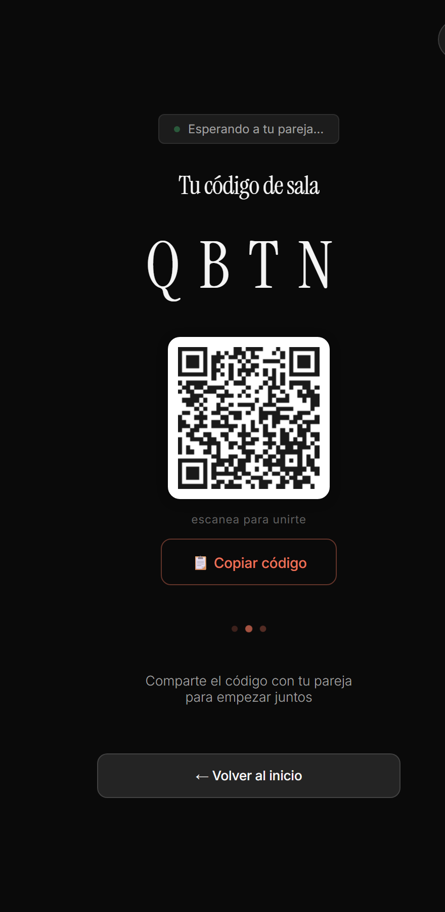

### Qué se ve

- **Estado:** `● Esperando a tu pareja...` (punto verde parpadeante).
- **Título:** *"Tu código de sala"*.
- **Código de sala** en grande (serif), p. ej. `QBTN` — 4 caracteres.
- **Código QR** (fondo blanco) que codifica el enlace de auto-unión `…/index.html?join=CODE`.
- Texto *"escanea para unirte"*.
- Botón **`📋 Copiar código`**.
- Animación de espera (tres puntos).
- Texto *"Comparte el código con tu pareja para empezar juntos"*.
- Botón **`← Volver al inicio`**.

### Comportamiento por control

| Control | Acción | Resultado |
|---------|--------|-----------|
| `📋 Copiar código` | `copyCode()` | Copia el código de sala al portapapeles. |
| `← Volver al inicio` | `confirmGoHome()` | Pide confirmación antes de salir y volver al Home (abandona la sala). |
| QR | — | Codifica `?join=CODE`; al escanearlo, el guest entra directo (ver abajo). |

### Qué está pasando por debajo

- El host está **suscrito al canal en tiempo real** de la sala y **sondeando** periódicamente si aparece la pareja.
- En cuanto detecta al guest, el host **avanza automáticamente** a la pantalla de **Setup** (elegir filtros). Esa transición no requiere ninguna acción manual.

---

## Cómo se une el guest

**Rol:** 🟣 guest. Hay **dos formas** de unirse, ambas terminan en `joinRoom()`:

1. **Escribiendo el código** en el Home: teclea el código de 4 caracteres en el campo *"Código de sala"* y pulsa **`Unirse →`**.
2. **Escaneando el QR** del host: el QR abre la app con `?join=CODE`, que **rellena el código y se une automáticamente** (sin teclear nada). Tras unirse, la URL se limpia para que al recargar no se re-una.

### Qué hace `joinRoom()`

1. **Valida el código:** debe tener **4 caracteres**. Si no → error *"El código debe tener 4 caracteres"*.
2. Marca al usuario como **guest** (`state.isHost = false`).
3. **Comprueba que la sala existe** (que haya registros en la base de datos):
   - Si **no existe** → error *"Sala no encontrada. ¿El código es correcto?"* y se queda en el Home.
4. Registra su **presencia** en la sala y carga los "me gusta" que ya tuviera la pareja.
5. Se conecta al **tiempo real** y pasa a la pantalla de espera.
6. Si el host **ya estaba** en la sala (caso normal al escanear el QR): muestra brevemente *"¡Pareja conectada! ✓"* y, según el momento, pasa a **Esperando filtros** mientras el host elige.

---

## Pantalla 3 · Esperando filtros (guest)

**ID:** `screen-waiting-filters` · **Rol:** 🟣 guest

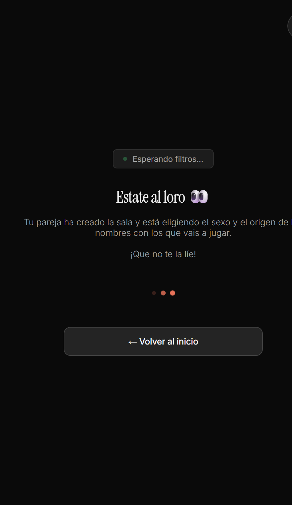

### Qué se ve

- **Estado:** `● Esperando filtros...`.
- **Título:** *"Estate al loro 👀"*.
- **Texto:** *"Tu pareja ha creado la sala y está eligiendo el sexo y el origen de los nombres con los que vais a jugar."*
- **Coletilla:** *"¡Que no te la líe!"*.
- Animación de espera (tres puntos).
- Botón **`← Volver al inicio`**.

### Comportamiento

- El guest **no elige filtros**: es una pantalla de espera pura. Los filtros los decide **solo el host** (en el Setup se lee *"Solo tú eliges los filtros — tu pareja recibirá los mismos"*).
- Cuando el host pulsa **`¡Empezar! →`**, sus filtros se propagan por tiempo real y **ambos pasan a la baraja de swipe** con la misma configuración.
- `← Volver al inicio` abandona la sala y regresa al Home.

---

---

## Pantalla 4 · Setup — elegir filtros (host)

**ID:** `screen-setup` · **Rol:** 🟠 host (el guest, mientras tanto, está en *Esperando filtros*)

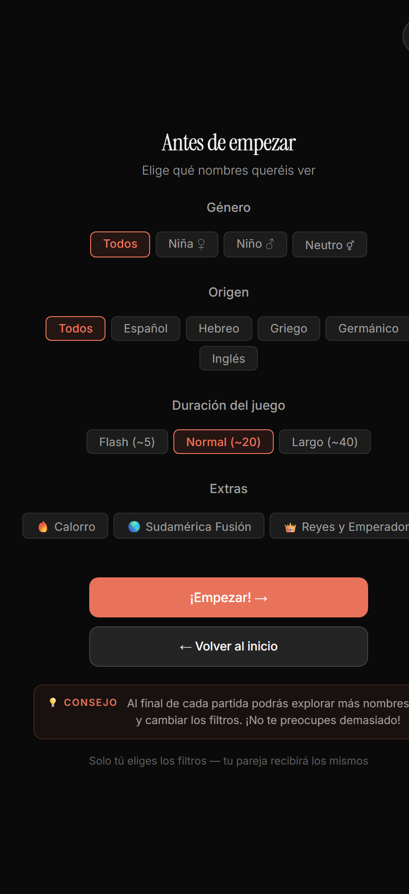

### Qué se ve

- **Título:** *"Antes de empezar"* · subtítulo *"Elige qué nombres queréis ver"*.
- **Género:** `Todos` · `Niña ♀` · `Niño ♂` · `Neutro ⚥` (por defecto: **Todos**).
- **Origen:** `Todos` · `Español` · `Hebreo` · `Griego` · `Germánico` · `Inglés` (por defecto: **Todos**).
- **Duración del juego:** `Flash (~5)` · `Normal (~20)` · `Largo (~40)` (por defecto: **Normal**).
- **Extras:** `🔥 Calorro` · `🌎 Sudamérica Fusión` · `👑 Reyes y Emperadores`.
- Botón **`¡Empezar! →`** y **`← Volver al inicio`**.
- Caja **💡 Consejo:** *"Al final de cada partida podrás explorar más nombres y cambiar los filtros. ¡No te preocupes demasiado!"*.
- Nota: *"Solo tú eliges los filtros — tu pareja recibirá los mismos"*.

### Comportamiento de los filtros

| Grupo | Tipo de selección | Notas |
|-------|-------------------|-------|
| Género | **Única** (elige uno) | — |
| Origen | **Única** (elige uno) | — |
| Duración | **Única** (elige uno) | Define cuántas cartas trae la baraja (~5 / ~20 / ~40). |
| Extras | **Packs exclusivos** | Solo uno a la vez; al activar un extra se **resetea Origen a "Todos"** (y `Neutro` → `Todos`). Y al elegir un Origen concreto se **desactivan los extras**. |

### 🟠 Al pulsar "¡Empezar! →"

Dispara `hostStartSwiping()`:

1. Genera una **semilla aleatoria** para barajar (así la baraja es idéntica para ambos).
2. **Publica los filtros** en la sala (registro `__filters__` por tiempo real).
3. Construye la baraja y **entra al Swipe**.
4. El guest, al recibir los filtros por realtime, **entra al Swipe a la vez** con la **misma baraja**.

---

## Pantalla 5 · Swipe — baraja de nombres (común)

**ID:** `screen-swipe` · **Rol:** común — **host y guest ven la misma baraja, sincronizada**

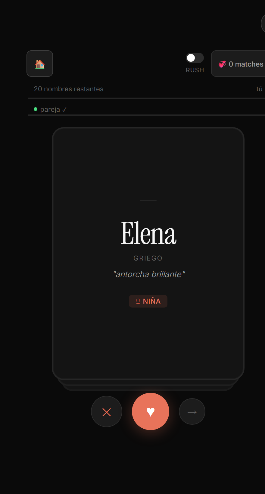

> Ambos usuarios ven **exactamente la misma carta** en el mismo orden (misma semilla). Cada
> uno vota a su ritmo; el *match* se detecta cuando **los dos** dan ❤️ al mismo nombre.

### Qué se ve

- **Barra superior:**
  - `🏠` — volver al inicio.
  - Toggle **`RUSH`** — modo rápido (solo en modo pareja).
  - **`💞 N matches`** — contador de coincidencias (se puede tocar para ver la lista).
- **Progreso propio:** *"N nombres restantes"* + etiqueta **`tú`** + barra de progreso.
- **Progreso de la pareja:** indicador **`● pareja ✓`** + su barra de progreso (para ver cómo va el otro).
- **Carta central** con la anatomía del nombre (ver abajo).
- **Botones de acción** (abajo): `✕` · `♥` · `→`.

### Anatomía de la carta

- **Nombre** (serif grande), p. ej. *Elena*.
- **Origen** en mayúsculas (p. ej. *GRIEGO*).
- **Significado** en cursiva (p. ej. *"antorcha brillante"*).
- **Badge de género** (p. ej. `♀ NIÑA` / `♂ NIÑO`).

### Controles

| Control | Acción | Significado |
|---------|--------|-------------|
| `✕` | `swipeCard(false)` | **No me gusta** (también swipe a la izquierda). |
| `♥` | `swipeCard(true)` | **Me encanta** (también swipe a la derecha). Si la pareja ya lo votó → **match**. |
| `→` | `swipeCard(null)` | **Saltar** el nombre sin decidir. |
| `🏠` | `confirmGoHome()` | Salir (pide confirmación). |
| `RUSH` | `toggleRush()` | Activa el modo rápido (opcional). |
| `💞 N matches` | `showLiked()` | Ver la lista de "me gusta" / matches hasta el momento. |

---

---

## Votar una carta (comportamiento del swipe)

Cada carta se vota de tres maneras (botón o gesto), vía `swipeCard()`:

| Acción | Botón | Gesto | Efecto |
|--------|-------|-------|--------|
| **Me gusta** | `♥` | arrastrar a la **derecha** | Registra tu "me gusta". Si la pareja **ya** lo había votado → **match**. |
| **No me gusta** | `✕` | arrastrar a la **izquierda** | Descarta el nombre. |
| **Saltar** | `→` | arrastrar hacia **arriba** | Pasa sin decidir (ni sí ni no). |

Detalles de comportamiento:

- Al arrastrar aparece una **pista visual** en la carta: `SÍ ♥` (derecha) o `NOP ✕` (izquierda).
- El voto se **envía por tiempo real** a la pareja (excepto en modo solitario).
- **Racha (streak):** si encadenas varios "me gusta" seguidos aparece un badge `🔥 N seguidos`; en pareja también puede mostrar `N sin match...`.
- Cuando la pareja vota un nombre que tú aún no has visto, al llegar a esa carta verás el indicador *"Tu pareja también lo valoró"*.
- **Detección de match:** hay match cuando existe tu ♥ **y** el ♥ de la pareja para el mismo nombre (`checkMatch()` / `swipeCard()`).

---

## Pantalla 6 · Match

**ID:** `screen-match` · **Rol:** común (aparece a quien completa la coincidencia)

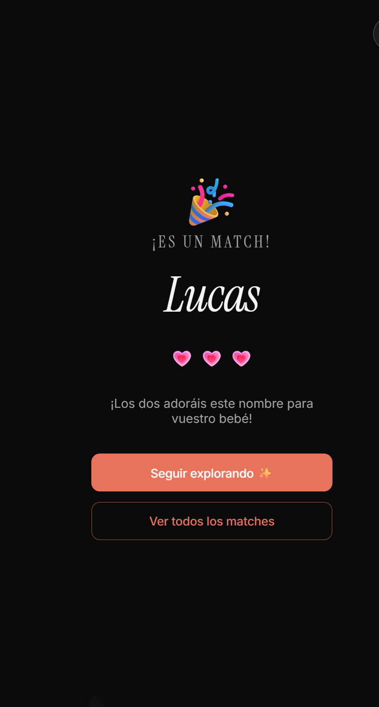

### Qué se ve

- Lluvia de corazones animada de fondo + 🎉.
- Rótulo **"¡ES UN MATCH!"**.
- **Nombre** coincidente en grande (serif itálica).
- **"¡Los dos adoráis este nombre para vuestro bebé!"**.
- Botón **`Seguir explorando ✨`** → vuelve al swipe (`continueAfterMatch()`).
- Botón **`Ver todos los matches`** → abre la lista de matches (`showLiked()`).

> La pantalla de match salta automáticamente en el momento de la coincidencia (salvo en **modo RUSH**, ver abajo).

---

## Modo RUSH (variante del swipe)

Toggle **`RUSH`** en la barra superior del swipe (`toggleRush()`), solo en modo pareja.

- Con RUSH **activado**, al hacer match **no** se abre la pantalla completa de Match: en su lugar aparece un **toast** breve `💞 <nombre>` sin cortar el ritmo del swipe.
- Pensado para ir rápido sin interrumpir el juego. El contador `💞 N matches` se sigue actualizando.

---

## Pantalla 7 · Matches / lista de "me gusta"

**ID:** `screen-liked` · **Rol:** común

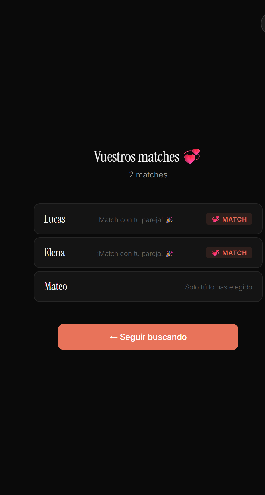

### Qué se ve

- Título **"Vuestros matches 💞"** y subtítulo dinámico (nº de matches o *"Aún sin matches con tu pareja"*).
- **Lista de los nombres a los que tú diste ♥**, marcando cuáles son **match** (`💞 Match` / *"¡Match con tu pareja! 🎉"*) y cuáles *"Solo tú lo has elegido"*.
- Si no has dado ♥ a nada: *"Aún no has dado ♥ a ningún nombre"*.
- Botón **`← Seguir buscando`** → vuelve al swipe (`backToSwipe()`).

Se abre desde el contador `💞 N matches` del swipe o desde `Ver todos los matches` en la pantalla de Match.

---

## Pantalla 8 · Fin de la baraja · Espera de resumen

**ID:** `screen-waiting-summary` · **Rol:** quien termina primero

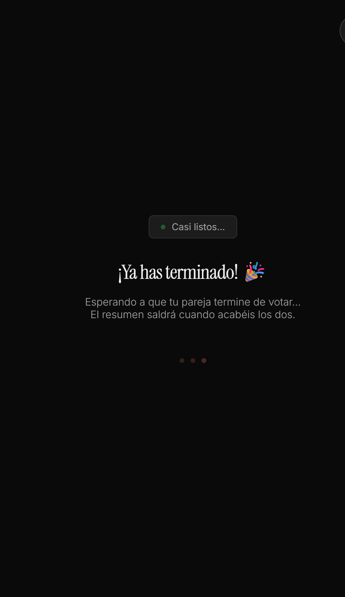

Cuando **acabas todas las cartas** (`finishSwiping()`):

- Se registra que **has terminado** (`__done__`) para avisar a la pareja.
- **Si la pareja ya había terminado** → se va directo al **Resumen**.
- **Si no** → muestra esta pantalla: **"¡Ya has terminado! 🎉 · Esperando a que tu pareja termine de votar…"** y **sondea** hasta que la pareja acaba; entonces ambos ven el Resumen.

---

## Pantalla 9 · Resumen final

**ID:** `screen-summary` · **Rol:** común (cuando **los dos** han terminado)

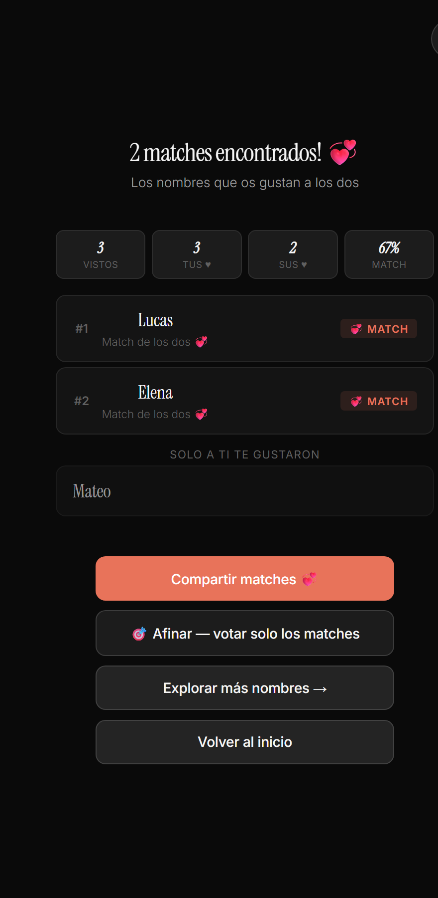

### Qué se ve

- Título dinámico **"N matches encontrados! 💕"** (o *"¡Habéis terminado!"* si no hay).
- **Tira de estadísticas:** `VISTOS` · `TUS ♥` · `SUS ♥` · `% MATCH`.
- **Lista rankeada de matches** (`#1`, `#2`, …) con etiqueta `💞 MATCH` (*"Match de los dos 💕"*).
- Sección **"SOLO A TI TE GUSTARON"** con los nombres que solo tú marcaste.
- Botones:
  - **`Compartir matches 💞`** → comparte por el share nativo o copia al portapapeles (`shareMatches()`).
  - **`🎯 Afinar — votar solo los matches`** → inicia el **modo Afinar** (`startRefineMode()`).
  - **`Explorar más nombres →`** → vuelve al setup **conservando filtros** para seguir con más nombres (`restartFromSetup()`).
  - **`Volver al inicio`** → salir (con confirmación).

---

## Modo Afinar (refinar los matches)

Desde el Resumen, **`🎯 Afinar`** (`startRefineMode()`) — requiere **≥ 2 matches**:

- La baraja se **reduce a solo los nombres que hicieron match**, y **ambos vuelven a votar** únicamente esos.
- Al terminar los dos, se muestra la pantalla **`screen-summary-refine`** (*"¡Afinado! 🎯"*) con los que siguen gustando a los dos.
- Se puede **elegir un ganador final**: cada uno pulsa su favorito y la app muestra la elección de ambos.
- Opciones: **`🎯 Afinar más`** (otra ronda), **`Compartir 💞`**, **`← Volver al resumen`**.

> Se puede afinar en **rondas sucesivas** para estrechar la lista hasta el nombre definitivo.

---

## Comportamientos transversales

### Volver al inicio (con confirmación)

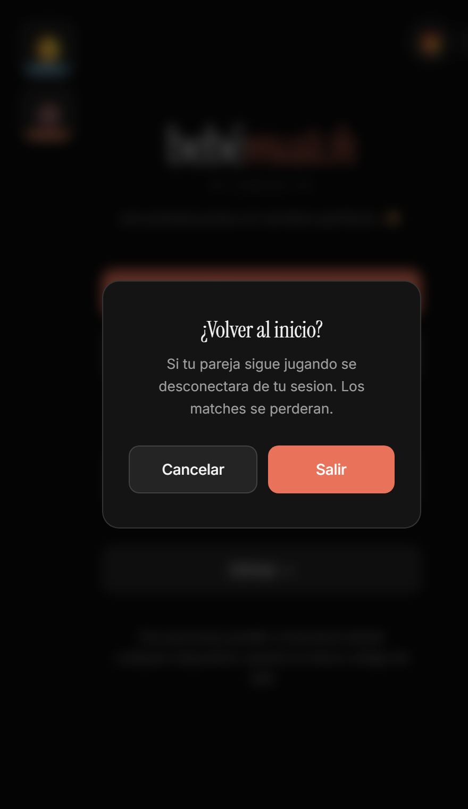

El botón `🏠` / `← Volver al inicio` abre un modal (`confirmGoHome()`):

- **"¿Volver al inicio?"** — en pareja avisa: *"Si tu pareja sigue jugando se desconectará de tu sesión. Los matches se perderán."*
- **`Cancelar`** cierra el modal · **`Salir`** abandona la sala, corta el tiempo real y vuelve al Home (`goHome()`).

### Reanudar sala

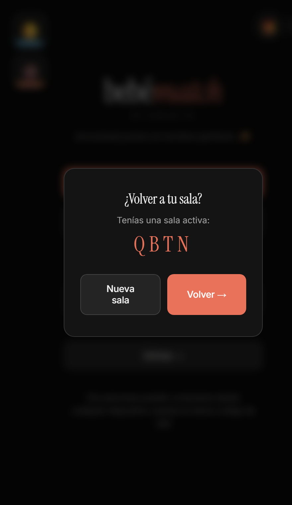

La sala activa se guarda localmente (`localStorage: bm_room`). Si vuelves a abrir la app con una sala pendiente (`checkResumeRoom()`):

- Modal **"¿Volver a tu sala?"** mostrando el código guardado.
- **`Volver →`** se re-une a esa sala (`resumeRoom()`) · **`Nueva sala`** la descarta.

### Estado y presencia de la pareja

- El indicador **`● pareja`** pasa a **`pareja ✓`** cuando el otro está conectado (`updatePartnerDot()`), a partir de los registros de **presencia** (`__presence__`).
- La **barra de progreso de la pareja** avanza según cuántas cartas lleva votadas el otro.

### Persistencia

- Se guarda `bm_room` al entrar a **waiting / setup / swipe**; se **borra** al volver al Home.
- **No hay cuentas:** la identidad (`myId`) es temporal por sesión; si recargas se genera otra.

---

## Pendiente / fuera de este documento

- **Modo solitario** (un jugador) reutiliza swipe/setup pero con su propio resumen `screen-summary-solo` (*"Tus favoritos"*, sin matches ni pareja). → documentar en su propio flujo.
- **Nombre del día** (🎁) y **easter egg / minijuegos** → fuera de alcance (omitidos a propósito).

_Flujo "Crear sala" documentado de principio a fin. Dime si quieres que arranque el flujo **solitario** o que ajuste algo de este._
