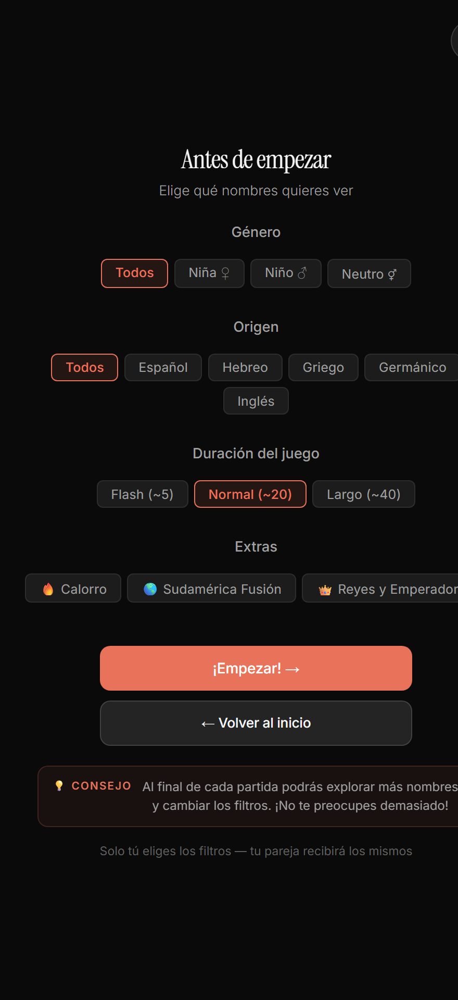
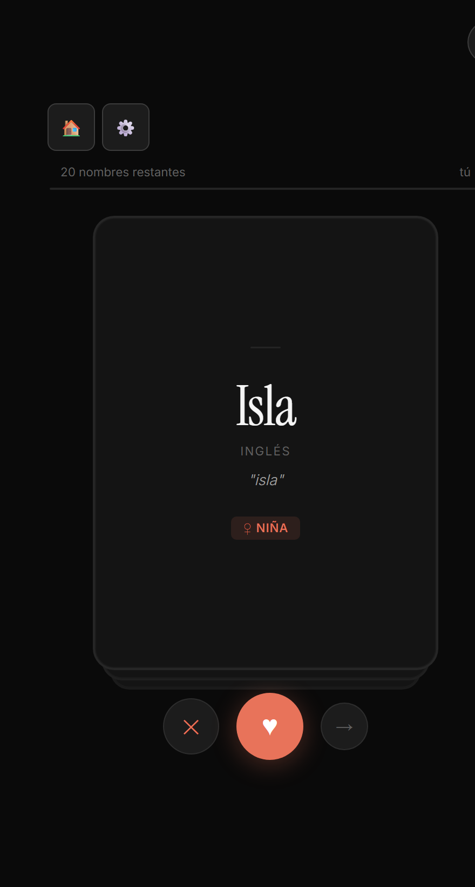
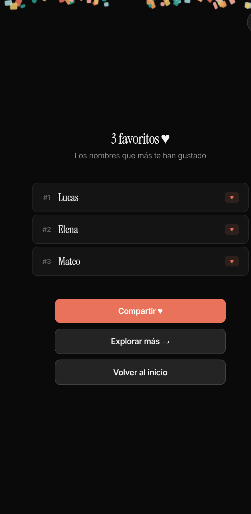

# Flujo · Modo en solitario (de principio a fin)

> Documenta, pantalla por pantalla, el **flujo del modo en solitario** (un jugador): explorar
> nombres y quedarte con tus favoritos, **sin sala, sin pareja y sin conexión en tiempo real**.
>
> Capturas en `../assets/flujos/flujo-en-solitario/`. Reconstruido desde `index.html` (v20.1).
> Comparte pantallas (setup, swipe) con el [flujo en pareja](./01-flujo-en-pareja.md); aquí se
> destacan **solo las diferencias**.

---

## Índice de pantallas del flujo

1. [Home (entrada)](#pantalla-1--home-entrada)
2. [Setup — elegir filtros](#pantalla-2--setup-elegir-filtros)
3. [Swipe — baraja de nombres](#pantalla-3--swipe-baraja-de-nombres)
4. [Votar y cambiar filtros a media partida](#votar-y-cambiar-filtros-a-media-partida)
5. [Resumen — tus favoritos](#pantalla-4--resumen--tus-favoritos)
6. [Diferencias clave vs. modo en pareja](#diferencias-clave-vs-modo-en-pareja)

### Resumen del flujo

```
Home
  │ pulsa "👤 Modo un jugador"
  ▼
Setup (elige filtros)            ⚙️ (se puede volver aquí a media partida)
  │ pulsa "¡Empezar! →"           ▲
  ▼                               │
Swipe (baraja local) ────────────┘
  │ al terminar la baraja
  ▼
Resumen — "Tus favoritos"
  ├─ Compartir ♥
  ├─ Explorar más →  (vuelve al Setup conservando filtros)
  └─ Volver al inicio
```

> **Sin red:** todo ocurre en el dispositivo. No hay código de sala, ni QR, ni presencia, ni
> matches con otra persona. La identidad (`myId`) sigue siendo temporal.

---

## Pantalla 1 · Home (entrada)

**ID:** `screen-home` · Es el **mismo Home** que en el flujo en pareja.


La entrada al modo solitario es el botón **`👤 Modo un jugador`**, que dispara `startSolo()`:

- Marca la sesión como **solitaria** (`state.isSolo = true`), sin código de sala.
- Reinicia el estado de juego y va directo al **Setup**.

> El resto de controles del Home (crear sala, unirse) pertenecen al [flujo en pareja](./01-flujo-en-pareja.md#pantalla-1--home).

---

## Pantalla 2 · Setup — elegir filtros

**ID:** `screen-setup` (compartida con pareja, en variante solitaria)



Es el mismo Setup que en pareja (Género · Origen · Duración · Extras + `¡Empezar! →`), con estas diferencias:

- **Subtítulo:** *"Elige qué nombres **quieres** ver"* (en pareja es *"queréis"*).
- **No hay pareja** esperando: al pulsar `¡Empezar! →` se entra directo al swipe (no se publica nada por red).
- El comportamiento de los filtros (selección única, packs de Extras exclusivos) es **idéntico** al del flujo en pareja — ver [su documentación](./01-flujo-en-pareja.md#comportamiento-de-los-filtros).

> ⚠️ **Observación (posible mejora):** en solitario sigue apareciendo la nota estática
> *"Solo tú eliges los filtros — tu pareja recibirá los mismos"*, que **no aplica** sin pareja.
> Conviene ocultarla en modo solitario.

---

## Pantalla 3 · Swipe — baraja de nombres

**ID:** `screen-swipe` (compartida con pareja, en variante solitaria)



Misma carta y mismos gestos que en pareja, pero la interfaz se **simplifica** al no haber pareja:

| Elemento | En pareja | En solitario |
|----------|-----------|--------------|
| Botón `🏠` volver | ✅ | ✅ |
| Botón `⚙️` cambiar filtros | ❌ (oculto) | ✅ **visible** |
| Toggle `RUSH` | ✅ | ❌ oculto |
| Contador `💞 N matches` | ✅ | ❌ oculto |
| Barra de progreso propia (`tú`) | ✅ | ✅ |
| Barra/indicador de **pareja** | ✅ | ❌ oculto |
| Badge de racha (`🔥 N seguidos`) | ✅ | ✅ |

La **anatomía de la carta** (nombre, origen, significado, badge de género) y los botones
`✕` / `♥` / `→` son iguales que en el [flujo en pareja](./01-flujo-en-pareja.md#anatomía-de-la-carta).

---

## Votar y cambiar filtros a media partida

### Votar (solitario)

- `♥` **guarda el nombre como favorito**; `✕` lo descarta; `→` lo salta.
- **No hay detección de match** (no hay segunda persona): el ♥ solo alimenta tu lista de favoritos.
- **Racha:** encadenar ♥ seguidos muestra el badge `🔥 N seguidos`.
- Nada se envía por red; todo es local.

### Cambiar filtros a media partida (`⚙️`)

El botón **`⚙️`** (`changeFiltersMidGame()`), exclusivo del modo solitario:

- **Guarda** tus "me gusta" actuales y te devuelve al **Setup** para cambiar filtros.
- Al pulsar `¡Empezar! →` de nuevo, **conserva** los favoritos que ya llevabas y sigue con la nueva selección.

---

## Pantalla 4 · Resumen — tus favoritos

**ID:** `screen-summary-solo`



Al terminar la baraja (`finishSolo()`):

- **Si marcaste favoritos:** título **"N favoritos ♥"**, subtítulo *"Los nombres que más te han gustado"* y **lista rankeada** (`#1`, `#2`, …) de tus ♥. Con **confeti** si son 3 o más.
- **Si no marcaste ninguno:** título **"¡Has terminado! 🙈"**, *"No has marcado ningún favorito"* y sugerencia *"Prueba con otros filtros."*.

### Botones

| Botón | Acción | Resultado |
|-------|--------|-----------|
| `Compartir ♥` | `shareSoloMatches()` | Comparte por el share nativo o copia al portapapeles: *"👶 Mis nombres favoritos son … ♥"*. |
| `Explorar más →` | `startSolo(true)` | Vuelve al Setup **conservando los filtros** para seguir con más nombres. |
| `Volver al inicio` | `goHome()` | Regresa al Home y reinicia el estado. |

---

## Diferencias clave vs. modo en pareja

| Aspecto | En pareja | En solitario |
|---------|-----------|--------------|
| Sala / código / QR | ✅ | ❌ |
| Conexión en tiempo real | ✅ | ❌ (todo local) |
| Pantalla de espera / presencia | ✅ | ❌ |
| Elección de filtros | Solo el host | El propio jugador |
| Match entre dos personas | ✅ | ❌ (solo favoritos propios) |
| Pantalla de Match / RUSH / Afinar | ✅ | ❌ |
| Cambiar filtros a media partida (`⚙️`) | ❌ | ✅ |
| Resumen | `screen-summary` (matches) | `screen-summary-solo` (favoritos) |
| Confirmación al salir | Avisa de desconexión de la pareja | Sin ese aviso (mensaje vacío) |
| Reanudar sala | ✅ (`bm_room`) | ❌ (no guarda sala) |

---

_Flujo "En solitario" documentado de principio a fin. Fuera de alcance: nombre del día (🎁) y
minijuegos / easter egg (omitidos a propósito)._
